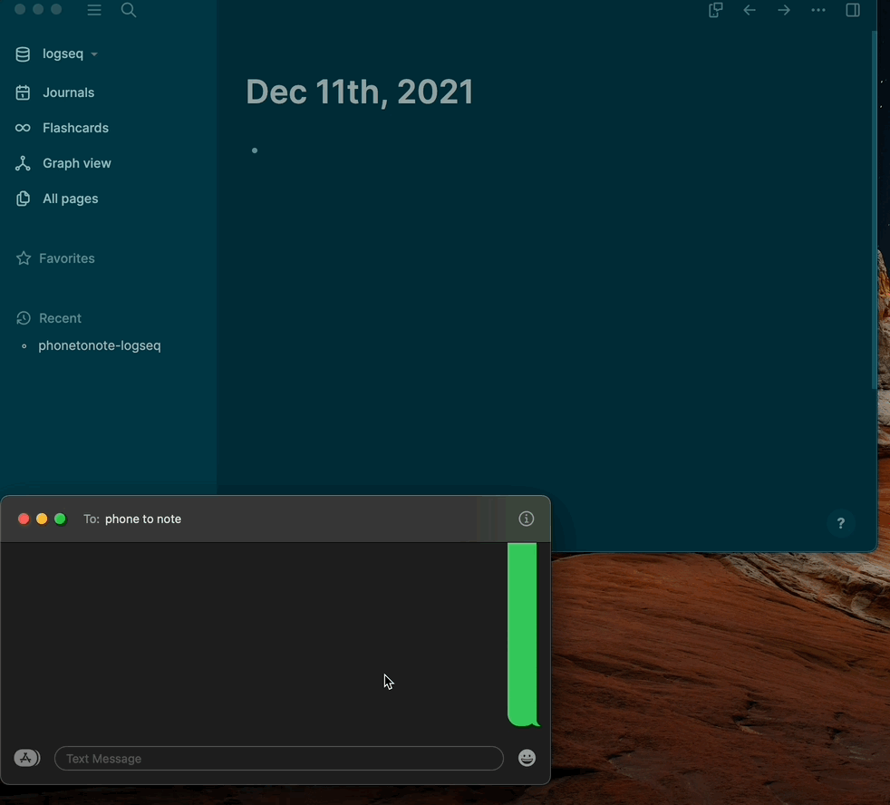

# phonetonote logseq

alpha version, see issues tab for list of features coming soon.

phonetonote-logseq requires creating an account at [https://phonetonote.com](https://phonetonote.com). once signed up, the `ptn_key` you need for configuration will be in your phonetonote dashboard.

## installation

this needs to be build locally using `yarn build` (to create the `dist` folder), then loaded into logseq. it will be available in the logseq marketplace soon.

## configuration

after installing, put your `ptn_key` and optionally a `ptn_hashtag` in the plugin settings file wherever you have logseq installed `.logseq/settings/_ptn.json`. you can also open this file by navigating to your logseq plugins, hovering over the settings icon in the phonetonote-logseq plugin, and clicking `Open settings`.

## usage

after installing and configuring, click the phone button next to the home button in the top menu to take you to `phonetonote-logseq` page

### Demo

